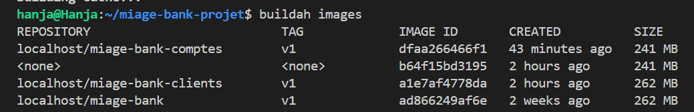

# 1. Pourquoi utiliser Buildah plutôt que Docker ? (Analyse A.1)

Pour ce projet, j'ai choisi d'utiliser **Buildah** au lieu de Docker pour plusieurs raisons concrètes rencontrées pendant le TP :

* **Pas de service en arrière-plan (Daemonless)** : Docker a besoin d'un moteur qui tourne tout le temps (`dockerd`). Buildah, lui, se lance uniquement quand on en a besoin. C'est plus léger pour mon environnement WSL.
* **Sécurité (Rootless)** : Avec Buildah, je n'ai pas besoin d'être "root" pour créer mes images. Ça évite de donner trop de droits au système et c'est beaucoup plus sécurisé.
* **Standard OCI** : Les images créées sont exactement les mêmes que celles de Docker. Elles sont compatibles partout (Kubernetes, Podman, etc.).
* **Pratique pour le CI/CD** : Dans un pipeline de déploiement automatique, Buildah est plus simple car il n'a pas besoin de "Docker-in-Docker", ce qui est souvent une galère à configurer.

---

# 2. Création des images MIAGE-Bank (Question A.2)

J'ai séparé l'application en deux micro-services : **clients** et **comptes**. Pour les construire, j'ai testé deux méthodes différentes.

## Méthode 1 : Avec le Containerfile (Le plus propre)
J'ai créé un seul `Containerfile` pour les deux services. Pour qu'il soit réutilisable, j'utilise une variable (`ARG JAR_FILE`) qui va chercher le bon fichier JAR selon le service.

**Le fichier de configuration :**
```dockerfile
FROM eclipse-temurin:17-jre-alpine
WORKDIR /app
ARG JAR_FILE
COPY ${JAR_FILE} app.jar
EXPOSE 8080
ENTRYPOINT ["java", "-jar", "app.jar"]
```

# Les commandes pour créer les deux images :

## Création du service Clients
buildah bud -f "Partie A/01-image-build/Containerfile" --build-arg JAR_FILE=src/AMSC/amc_clients/target/amc_clients-0.0.1-SNAPSHOT.jar -t localhost/miage-bank-clients:v1 .
## Création du service Comptes
buildah bud -f "Partie A/01-image-build/Containerfile" --build-arg JAR_FILE=src/AMSC/amc_comptes/target/amc_comptes-0.0.1-SNAPSHOT.jar -t localhost/miage-bank-comptes:v1 .


## Méthode 2 : Commande par commande (Mode natif)
J'ai aussi testé la création "à la main" sans fichier de config. C'est pratique pour tester rapidement ou faire des scripts personnalisés.
J'ai aussi testé la création "à la main" sans fichier de config. C'est pratique pour tester rapidement ou faire des scripts personnalisés.

Les commandes exécutées :

# Exemple de création pas à pas pour le service clients
container=$(buildah from eclipse-temurin:17-jre-alpine)
buildah copy $container src/AMSC/amc_clients/target/amc_clients-0.0.1-SNAPSHOT.jar app.jar
buildah commit $container localhost/miage-bank-clients:v1

# Vérification et Problèmes rencontrés
## Mes images créées

Une fois les builds terminés, j'ai vérifié que mes deux images étaient bien présentes dans mon stockage local.

Commande : buildah images

 

## Le souci du "Socket Docker"

Quand j'ai voulu utiliser Dive et Trivy, ils ont planté car ils cherchaient Docker (qui n'est pas installé). Pour régler ça, j'ai exporté mes images en fichiers .tar. Ça permet aux outils de lire l'image sans avoir besoin que Docker tourne.

Commande pour débloquer la situation :
buildah push localhost/miage-bank-clients:v1 docker-archive:clients.tar
buildah push localhost/miage-bank-comptes:v1 docker-archive:comptes.tar
