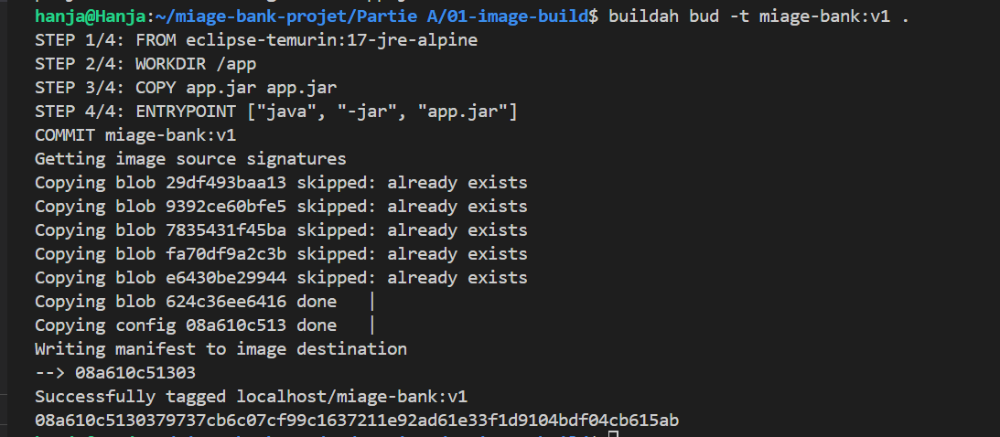
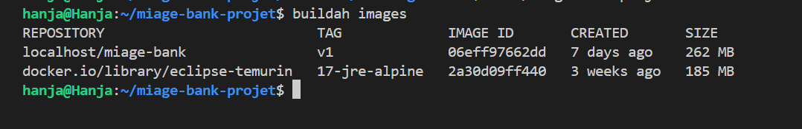

# 01 - Construction de l'image (Questions A.1 & A.2)

Ce module couvre l'analyse comparative des outils de build et la création de l'image pour le microservice `amc_clients` (MIAGE-Bank).

## A.1. Analyse Comparative : Docker vs Buildah

Conformément aux objectifs de la Partie A, voici l'analyse des différences fondamentales identifiées lors de la manipulation :

* **Architecture** : Docker repose sur un démon (`dockerd`) avec privilèges root pour gérer les builds. À l'inverse, **Buildah est "daemonless"** et s'exécute comme un processus standard, ce qui allège la consommation de ressources.
* **Sécurité** : Buildah permet une exécution en espace utilisateur (**rootless**). Cela réduit considérablement la surface d'attaque en évitant l'escalade de privilèges au niveau de l'hôte.
* **Conformité OCI** : Buildah produit nativement des images conformes aux standards de l'Open Container Initiative (OCI), garantissant une compatibilité totale avec les orchestrateurs comme Kubernetes sans dépendance à Docker.
* **Cas d'usage CI/CD** : Buildah est particulièrement optimisé pour les environnements de pipelines (runners GitLab/GitHub), évitant les problématiques complexes et peu sécurisées du "Docker-in-Docker".

## A.2. Build de MIAGE-Bank avec Buildah

Nous avons généré l'image `miage-bank:v1` en explorant deux approches complémentaires.

### Approche A : Utilisation du Containerfile (Déclaratif)
C'est l'approche standard privilégiée pour le versioning et l'automatisation (GitOps). 
* **Image de base** : `eclipse-temurin:17-jre-alpine`. Ce choix combine la stabilité du JRE 17 et la légèreté d'Alpine Linux.
* **Commande** : `buildah bud -t miage-bank:v1 .`

### Approche B : Construction "Layer par Layer" (Natif)
Buildah permet de manipuler l'image sans fichier descripteur via ses commandes natives :
1. `container=$(buildah from eclipse-temurin:17-jre-alpine)`
2. `buildah copy $container app.jar /app/app.jar`
3. `buildah config --entrypoint '["java", "-jar", "/app/app.jar"]' $container`
4. `buildah commit $container miage-bank:v1`

### Comparaison et Conclusion
Bien que les deux approches produisent une image identique :
- Le **Containerfile** assure une meilleure reproductibilité au sein d'une équipe.
- Le **mode natif** offre une flexibilité supérieure pour des scripts de build dynamiques où les couches doivent être manipulées de manière programmatique.

## Preuves de réalisation

### Succès du build (Via Containerfile)

### Inventaire des images locales dans Buildah

---
*L'image a ensuite été exportée au format OCI via la commande :*
`buildah push miage-bank:v1 oci-archive:image.tar`