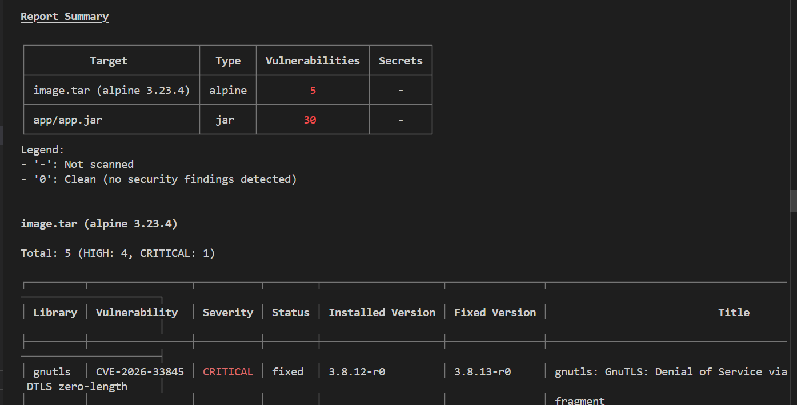

# 02 - Analyse de sécurité (Question A.3)

Pour l'analyse de sécurité, j'ai choisi de scanner l'image socle miage-bank:v1 car elle contient l'intégralité du code et de l'environnement (Alpine + Tomcat + Spring) qui sert de base à nos micro-services

## 1. Méthodologie du Scan
Conformément aux consignes, l'analyse a été paramétrée comme suit :
- **Cible** : Image locale via export `image.tar`.
- **Filtrage** : Uniquement les sévérités **HIGH** et **CRITICAL**.
- **Livrables** : Rapports disponibles en formats JSON et SARIF dans le dossier `reports/`.

## 2. Rapport de Scan (Vue Table)

## 3. Analyse détaillée et Plan de remédiation

Le scan a identifié 35 vulnérabilités majeures (30 dans le JAR et 5 dans l'image de base Alpine). Voici l'analyse des plus critiques :

### A. Vulnérabilités de l'OS (Alpine 3.23.4)
| CVE | Librairie | Sévérité | Description | Remédiation |
| :--- | :--- | :--- | :--- | :--- |
| **CVE-2026-33845** | `gnutls` | **CRITICAL** | Déni de service (DoS) via des fragments DTLS de longueur nulle. | Mettre à jour `gnutls` vers la version `>= 3.8.13-r0`. |
| **CVE-2026-33846** | `gnutls` | **HIGH** | DoS via un débordement de tampon (heap buffer overflow). | Mise à jour système via `apk upgrade`. |

### B. Vulnérabilités Applicatives (app/app.jar)
| CVE | Librairie | Sévérité | Description | Remédiation |
| :--- | :--- | :--- | :--- | :--- |
| **CVE-2025-24813** | `tomcat-embed` | **CRITICAL** | Potentielle exécution de code à distance (RCE) via des requêtes PUT partielles. | Monter la version de Tomcat vers `>= 10.1.35`. |
| **CVE-2024-38816** | `spring-webmvc` | **HIGH** | *Path Traversal* : accès non autorisé à des fichiers système via des ressources mal validées. | Update Spring Framework vers `>= 6.1.13`. |
| **CVE-2024-22259** | `spring-web` | **HIGH** | Défaut de validation d'hôte dans le parsing d'URL (risque de redirection SSRF). | Update Spring Framework vers `>= 6.1.5`. |

## 4. Conclusion sur la "Security Gate"
L'image **échoue** actuellement à la gate de sécurité car elle contient **3 vulnérabilités CRITICAL**.

**Plan d'action pour mise en conformité :**
1. **OS** : Ajouter `RUN apk update && apk upgrade` dans le `Containerfile` pour corriger les failles de l'image de base.
2. **Application** : Réviser le fichier `pom.xml` pour forcer des versions sécurisées des dépendances Spring Boot et Tomcat.