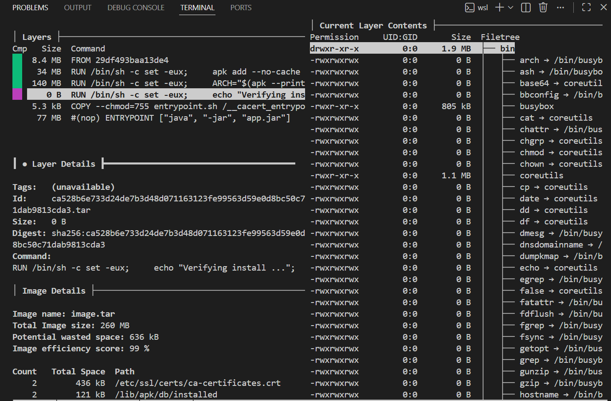

# 03 - Audit de l'image avec Dive (Question A.4)

Ce module présente l'analyse de l'optimisation des couches de l'image `miage-bank:v1`.

## 1. Validation de la "Security Gate"
L'audit Dive confirme que l'image respecte les critères de performance :
* **Score d'efficacité** : 99 %
* **Taille totale** : 260 MB
* **Espace gaspillé** : 636 kB

## 2. Analyse détaillée des couches (Layers)
D'après l'analyse visuelle, l'image est composée de 6 couches principales :
1. **Base OS (8.4 MB)** : Image Alpine initiale.
2. **Setup APK (34 MB)** : Installation des outils nécessaires.
3. **JRE Runtime (140 MB)** : Environnement d'exécution Java 17.
4. **Scripts & Config (5.3 kB)** : Ajout de l'entrypoint et des certificats.
5. **Application JAR (77 MB)** : Le microservice MIAGE-Bank.

## 3. Identification des fichiers superflus
Dive identifie 636 kB d'espace gaspillé. Les fichiers responsables sont :
- **/etc/ssl/certs/ca-certificates.crt** (436 kB) : Présent en double car modifié/ajouté lors du build.
- **/lib/apk/db/installed** (121 kB) : Fichier de base de données du gestionnaire de paquets Alpine.

## 4. Stratégie d'optimisation (Avant / Après)
* **Approche Standard** : Utilisation d'une image JDK complète (souvent > 500 MB).
* **Approche Optimisée (Actuelle)** : Utilisation de `eclipse-temurin:17-jre-alpine`.
* **Résultat** : Une taille finale de **260 MB**, soit une réduction significative pour accélérer les transferts réseau et le déploiement sur Kubernetes.

**Conclusion** : L'image est validée pour la mise en production.