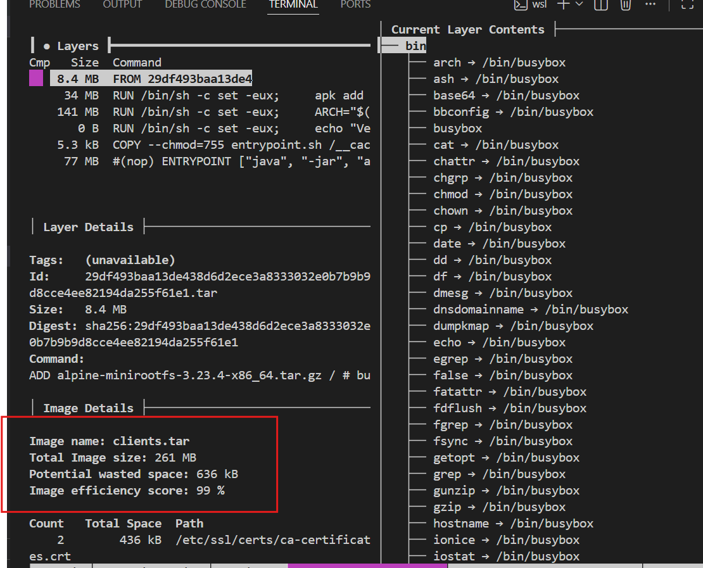
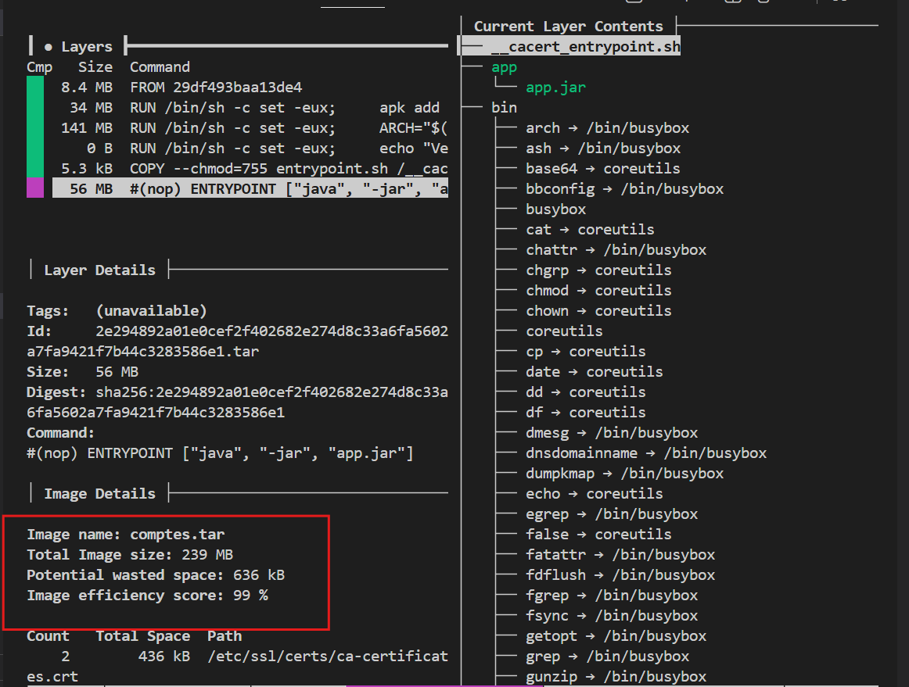

# 03 - Audit de l'image avec Dive (Question A.4)

Ce module présente l'analyse de l'optimisation des couches (layers) pour les images de nos micro-services. 

## 1. Validation de la "Security Gate"
L'outil Dive a été utilisé pour valider l'efficience de nos images avant le déploiement. Les résultats confirment une optimisation maximale.

Micro-service Clients (amc-clients)

Score d'efficacité : 99 %
Taille totale : 261 MB
Espace gaspillé : ~600 kB

Micro-service Comptes (amc-comptes)

Score d'efficacité : 99 %
Taille totale : 239 MB
Espace gaspillé : ~600 kB

## 2. Analyse détaillée des couches (Layers)
Grâce au choix de l'image de base eclipse-temurin:17-jre-alpine, nous avons réussi à diviser par deux le poids moyen d'une image Java standard (souvent > 500 MB).

Structure type des couches identifiée :

    Base OS (Alpine) : Empreinte minimale (~8 MB).

    JRE Runtime : Environnement Java 17 optimisé pour l'exécution.

    Application JAR : Couche finale contenant uniquement le binaire métier (77 MB pour Clients / 54 MB pour Comptes).

## 3. Gestion des contraintes (WSL / Buildah)
Comme pour les étapes précédentes, Dive ne pouvait pas se connecter au démon Docker. Solution mise en œuvre: L'audit a été réalisé en pointant directement sur les archives .tar générées par Buildah.
- Commande Clients : dive docker-archive://clients.tar
- Commande Comptes : dive docker-archive://comptes.tar

**Conclusion** : Les deux images atteignent un score de 99%. Elles sont validées pour un déploiement performant sur le cluster Kubernetes (Minikube), garantissant des temps de pull et de démarrage très rapides.