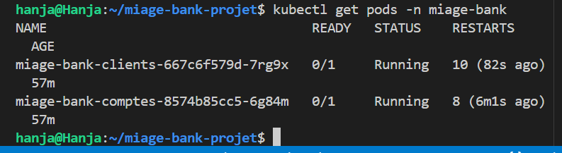
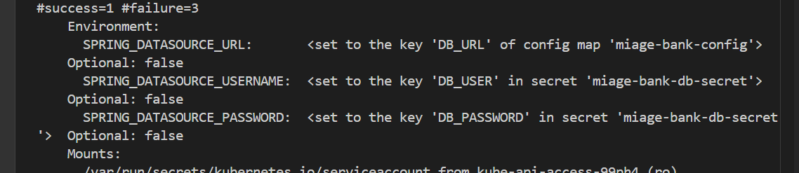
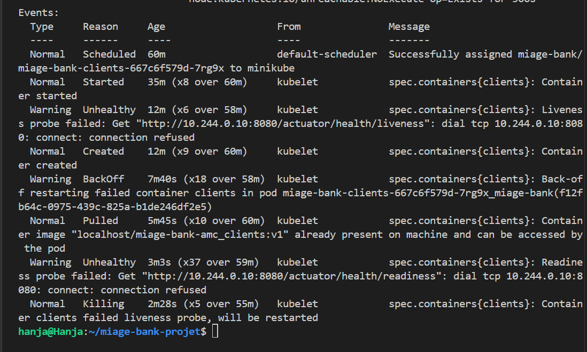

# 02 - Stratégie de déploiement des micro-services Java

Ce module gère le déploiement automatisé de l'infrastructure micro-services de la MIAGE-Bank via **Helm**, **Buildah** et **Minikube**.

---

## 1. Architecture et Templating Helm
L'architecture repose sur un Chart Helm unique conçu pour être modulaire et évolutif.

* **Déploiement Dynamique :** Utilisation d'une boucle Helm (`range`) dans le fichier `deployment.yaml` pour instancier simultanément les services `amc-clients` et `amc-comptes` à partir d'une liste définie dans le `values.yaml`.
* **Centralisation :** Les configurations communes (URL Database, Profiles Spring) sont mutualisées via une ConfigMap unique.
* **Sécurité :** Les identifiants sensibles sont isolés et injectés via des Secrets Kubernetes.
* **Fichiers clés :** `deployment.yaml` (modèle), `values.yaml` (variables), `configmap.yaml` (environnement).

---

## 2. Pré-requis
* **Java 17 & Maven :** Pour la compilation des sources.
* **Buildah :** Pour la création des images de conteneurs OCI.
* **Minikube :** Cluster Kubernetes local pour l'exécution.
* **Helm v3 :** Pour l'orchestration et la gestion des releases.

---

## 3. Procédure d'installation

### Étape 1 : Compilation des Micro-services (Maven)
Générer les artefacts JAR pour chaque service :

        # Dans chaque dossier src/AMSC/amc_clients et amc_comptes
        mvn clean package -DskipTests

### Étape 2 : Construction et Chargement des Images (Buildah)
Les images sont construites localement puis transférées dans le cluster Minikube :

# Exemple pour amc_clients
buildah bud -t localhost/miage-bank-amc_clients:v1 .
minikube image load localhost/miage-bank-amc_clients:v1 --overwrite 

### Étape 3 : Initialisation de l'Infrastructure (Secrets)
Avant le déploiement, créer le secret nécessaire à la connectivité :

        kubectl create secret generic miage-bank-db-secret \
        --from-literal=DB_USER=admin \
        --from-literal=DB_PASSWORD=password123 \
        -n miage-bank
### Étape 4 : Déploiement via Helm

Lancer l'orchestration complète :
Bash

helm upgrade --install miage-bank "./Partie B/miage-bank" --namespace miage-bank --create-namespace

## 4. Analyse et Validation

Une fois le déploiement effectué, la validation s'appuie sur deux points de contrôle :
### A. État des Pods

La commande kubectl get pods -n miage-bank permet de vérifier que les instances sont créées et supervisées. Le statut Running confirme que les images ont été correctement chargées.

### B. Injection des configurations (Describe)

L'analyse via kubectl describe pod confirme que :

    Les variables d'environnement (SPRING_DATASOURCE_URL, etc.) sont correctement liées à la ConfigMap et au Secret.

    Le cycle de vie est géré par les sondes Liveness et Readiness, garantissant l'auto-cicatrisation du système (Self-healing).

